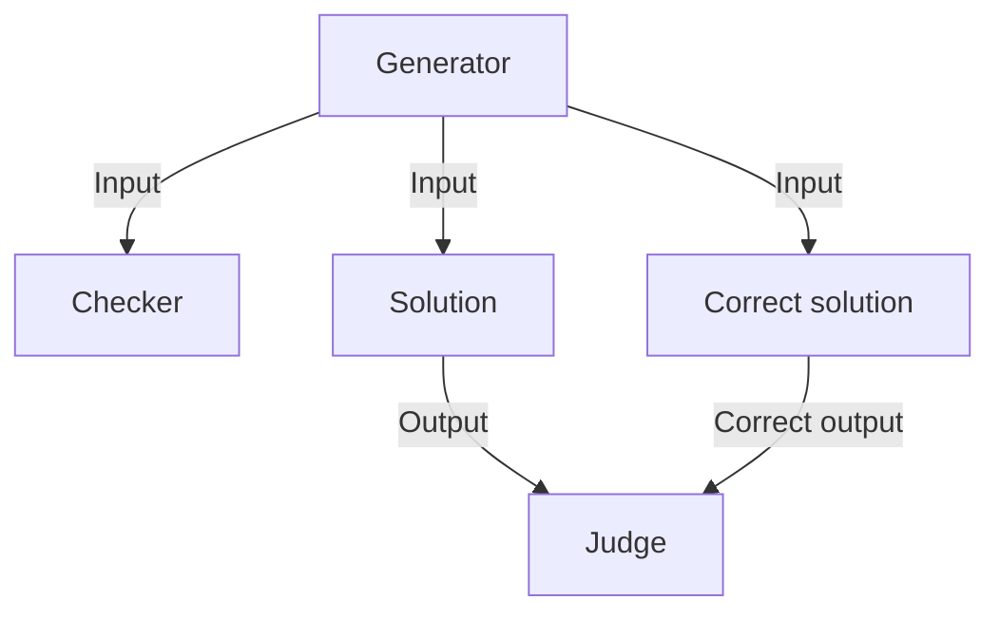
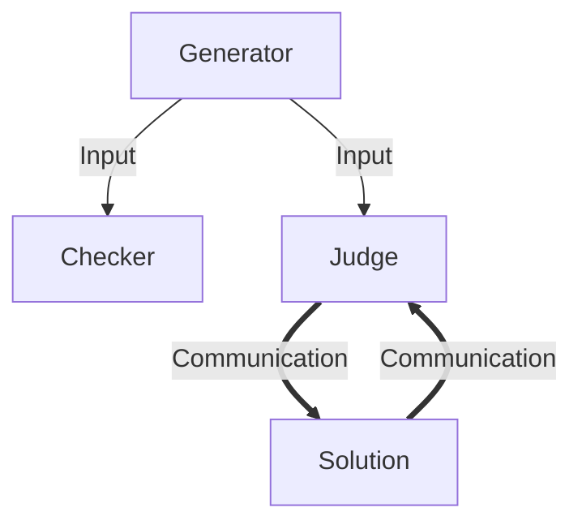

# Task overview
*Task overview is for those who are familiar with competitive programming but haven't made tasks yet.*
*If you already made some tasks, look at the task type diagrams [here](#batch-task) and [here](#interactive-task), to brush up on potential differences in terminology.*

## Task components

There are several task components author needs to write.

### Task statement

Task statement is there for contestant too read.
Pisek doesn't handle task statements, so you are free to write them however you want.

### Subtasks

Pisek however does need to know about subtasks. That usually are some additional restrictions
on task statements to allow weaker solutions to get some points. These can be lower limits
for slower solutions, or special cases of the original task statement.

Some tasks have only one subtask (ICPC tasks) while others have many (IOI tasks).
Subtasks need to be entered in config.

### Solution

First and most known task component is the solution.
It is same as what the contestant should write - taking the input and producing output.

One of the solutions should be the **primary solution**, always producing correct output.
It is also recommended to write some wrong solutions to ensure they don't pass.

### Generator
*More details about the generator in [generator.md](./generator.md).*

Generator is used for generating inputs that the solution is tested upon.
Ideally generator should generate diverse enough inputs to break any wrong solution.

### Judge

Judge is used for determining whether given solution is correct.
It greatly differs between task types, so you read more there.

### Checker

Checker is used for checking whether inputs produced by generator
conform to the task statement. It adds additional degree of safety.

## Task types

There are few types of tasks pisek supports:
1. [Batch task](#batch-task)
2. [Interactive task](#interactive-task)

### Batch task

#### Batch judge
*__TODO__: Add details about batch judge in [batch_judge.md](./batch_judge.md).*

Batch judge gets solution output and should say whether it is correct.
It can also get correct output (from the primary solution) as specified in config.

### Interactive task

#### Interactive judge
*__TODO__: Add details about batch judge in [interactive_judge.md](./interactive_judge.md).*

Judge in interactive task gets task input and is run together with the solution.
The solution can make requests to the judge about the input. Finally, judge says
whether the solution is correct.

One example would be that judge gets a hidden sequence in the input.
Solution then makes queries to the judge and reconstructs the hidden sequence.
After giving this sequence to the judge, the solution is marked by the judge
as correct on this input.
